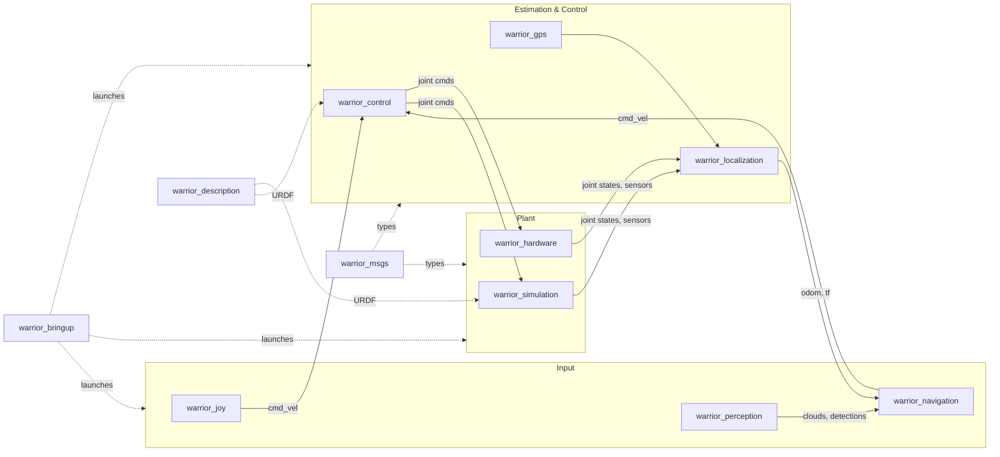

# Warrior 2026

ROS 2 stack for Wayne Robotics' 2026 IGVC entry. Targets **ROS 2 Humble** +
**Gazebo Fortress** on **Ubuntu 22.04**.

## Quick start

### Installation
Follow the warrior_scripts Readme for installation instructions

### Launch
Follow the warrior_bringup Readme for launch instructions

## System layout

## Packages

| Package | What it does | README |
|---|---|---|
| [warrior_bringup](warrior_bringup/) | Top-level launchers (sim, real, turtlebot variants) + systemd unit | [README](warrior_bringup/README.md) |
| [warrior_control](warrior_control/) | Swerve / diff drive controllers, kinematics | [README](warrior_control/README.md) |
| [warrior_description](warrior_description/) | URDF / xacro / meshes | [README](warrior_description/README.md) |
| [warrior_gps](warrior_gps/) | GPS + AprilTag fusion nodes | [README](warrior_gps/README.md) |
| [warrior_gps_dual](warrior_gps_dual/) | Dual u-blox NMEA GPS → two NavSatFix topics for EKF | [README](warrior_gps_dual/README.md) |
| [warrior_hardware](warrior_hardware/) | `ros2_control` HW interface + USB driver for swerve Arduinos and SPARK MAXes | [README](warrior_hardware/README.md) |
| [warrior_joy](warrior_joy/) | Gamepad → cmd_vel | [README](warrior_joy/README.md) |
| [warrior_localization](warrior_localization/) | EKF, SLAM, sensor fusion | [README](warrior_localization/README.md) |
| [warrior_msgs](warrior_msgs/) | Custom message definitions | [README](warrior_msgs/README.md) |
| [warrior_navigation](warrior_navigation/) | Costmaps, path planning, Nav2 integration | [README](warrior_navigation/README.md) |
| [warrior_perception](warrior_perception/) | Perception model harness, Lidar SDK, Omnivision | [README](warrior_perception/README.md) |
| [warrior_scripts](warrior_scripts/) | Install scripts + dev helpers | [README](warrior_scripts/README.md) |
| [warrior_simulation](warrior_simulation/) | Gazebo worlds + SDF models | [README](warrior_simulation/README.md) |

## Where things live

- **Launch anything** → [warrior_bringup](warrior_bringup/README.md)
- **Install / first-time setup** → [warrior_scripts](warrior_scripts/README.md)
- **Robot kinematics & math** → [warrior_control](warrior_control/README.md)
- **Sim worlds** → [warrior_simulation](warrior_simulation/README.md)
- **Real-hw control flow** → [warrior_hardware](warrior_hardware/README.md)
- **Lidar / cameras / perception** → [warrior_perception](warrior_perception/README.md)
