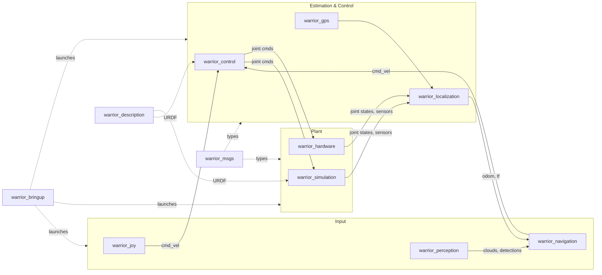

# Warrior 2026

ROS 2 stack for Wayne Robotics' 2026 IGVC entry. The Pixi lock targets Linux
`x86_64` and `aarch64` with **ROS 2 Humble** + **Gazebo Fortress**.

## Quick start

The development environment is managed by [Pixi](https://pixi.sh). Do not
source an apt-installed ROS environment before running these commands.

```bash
# One-time Pixi installation (skip when `pixi --version` already works)
curl -fsSL https://pixi.sh/install.sh | bash
export PATH="${HOME}/.pixi/bin:${PATH}"

git clone git@github.com:waynerobotics/Warrior_2026.git
cd Warrior_2026
pixi install
pixi run build
pixi run launch-sim
```

The committed [pixi.lock](pixi.lock) contains resolved ROS 2 Humble
environments for `linux-64` and `linux-aarch64`. Pixi keeps its environment in
`.pixi/` and the ROS overlay in `install/pixi/`; project setup does not modify
`/opt/ros` or apt sources.

Everyday commands use `pixi run <task>`. Pixi reuses `pixi.lock` while it
matches `pixi.toml` and can update it when dependencies change. Keep the
lockfile in Git so fresh installs share the same resolved versions. Use
`pixi update` for intentional dependency upgrades; `--locked` is optional
for CI or checks that must fail when the manifest and lockfile disagree.

| Command | Purpose |
|---|---|
| `pixi run build` | Build the base stack, excluding TensorRT perception packages. |
| `pixi run test` | Rebuild and run the ROS tests. |
| `pixi run launch-sim` | Build and launch the default swerve simulation for manual driving. |
| `pixi run launch-nav-sim` | Build and launch the swerve simulation with mapless, odom-relative Nav2. |
| `pixi run launch-gps-sim` | Build and launch MTi-680G GPS/IMU navigation with wheel odometry, lidar avoidance and a waypoint mission. |
| `pixi run launch-igvc2027-gazebo` | Launch Warrior's GPS mission in the complete P37 AutoNav approximation. |
| `pixi run launch-igvc2027-isaac` | Spawn Warrior in Isaac Sim and drive the four GPS targets with simulated sensors. |
| `pixi run inspect-igvc2027-isaac` | Inspect the matching Isaac course without starting a robot mission. |
| `pixi run launch-real` | Build and launch real-robot Xbox teleoperation. |
| `pixi run build-perception` | Build `neural_engine` + `omnivision`; requires host CUDA and TensorRT. |
| `pixi shell` | Open an activated shell for arbitrary `ros2`/`colcon` commands. |

For keyboard controls and sending a navigation goal from RViz or the command
line, see the [bringup simulation guide](warrior_bringup/README.md#simulation-workflows).

GPS waypoint navigation supports **with wheel odometry** (default) and
**without wheel odometry**. After `pixi run build`, launch the full updated
IGVC 2027 map without wheel odometry in either simulator:

```bash
# Gazebo: full updated IGVC 2027 map
pixi run ros2 launch warrior_bringup igvc2027_autonav.launch.py use_wheel_odometry:=false

# Isaac Sim: full updated IGVC 2027 map
pixi run ros2 launch warrior_bringup igvc2027_isaac_nav.launch.py use_wheel_odometry:=false
```

Change `false` to `true` in either command to enable wheel odometry.
`swerve_gps_nav_sim.launch.py` uses the smaller schematic no-man's-land map.
Both simulators model one Xsens MTi-680G
RTK GNSS/INS; without wheel odometry, GNSS velocity and IMU measurements supply
local motion while GNSS position corrects the global pose. Sensor assumptions
and topic contracts are documented in the [localization guide](warrior_localization/README.md).

The [IGVC 2027 course guide](warrior_simulation/igvc2027/README.md) includes
simulator previews, geographic provenance, generated GPS targets and editing instructions.

The test task reports the repository's existing lint/test debt instead of
hiding it; the migration baseline is not yet a green test suite.

Native execution already has host networking, display, and device visibility.
Real hardware still needs normal host permissions (for example `dialout` for
serial and access to video/input devices). Jetson inference uses the CUDA and
TensorRT supplied by JetPack and must be validated on the target Jetson. See
[warrior_scripts/README.md](warrior_scripts/README.md) for workflow details and
[warrior_bringup/README.md](warrior_bringup/README.md) for launch choices.

## System layout


```mermaid
flowchart LR
    subgraph INPUT["Input"]
        JOY[warrior_joy]
        NAV[warrior_navigation]
        PERC[warrior_perception]
    end

    subgraph BRAIN["Estimation & Control"]
        LOC[warrior_localization]
        GPS[warrior_gps]
        CTRL[warrior_control]
    end

    subgraph PLANT["Plant"]
        SIM[warrior_simulation]
        HW[warrior_hardware]
    end

    DESC[warrior_description]
    BRINGUP[warrior_bringup]
    MSGS[warrior_msgs]

    JOY -->|cmd_vel| CTRL
    NAV -->|cmd_vel| CTRL
    CTRL -->|joint cmds| HW
    CTRL -->|joint cmds| SIM
    HW -->|joint states, sensors| LOC
    SIM -->|joint states, sensors| LOC
    GPS --> LOC
    PERC -->|clouds, detections| NAV
    LOC -->|odom, tf| NAV
    DESC -.->|URDF| SIM
    DESC -.->|URDF| CTRL
    BRINGUP -.->|launches| BRAIN
    BRINGUP -.->|launches| PLANT
    BRINGUP -.->|launches| INPUT
    MSGS -.->|types| BRAIN
    MSGS -.->|types| PLANT
```

## Packages

| Package | What it does | README |
|---|---|---|
| [warrior_bringup](warrior_bringup/) | Top-level launchers (sim, real, turtlebot variants) + systemd unit | [README](warrior_bringup/README.md) |
| [warrior_control](warrior_control/) | Swerve / diff drive controllers, kinematics | [README](warrior_control/README.md) |
| [warrior_description](warrior_description/) | URDF / xacro / meshes | [README](warrior_description/README.md) |
| [warrior_gps](warrior_gps/) | GPS + AprilTag fusion nodes | [README](warrior_gps/README.md) |
| [warrior_gps_dual](warrior_gps_dual/) | Dual u-blox NMEA GPS → two NavSatFix topics for EKF | [README](warrior_gps_dual/README.md) |
| [warrior_hardware](warrior_hardware/) | `ros2_control` HW interface + USB driver for swerve Arduinos and SPARK MAXes | [README](warrior_hardware/README.md) |
| [warrior_joy](warrior_joy/) | Gamepad → cmd_vel | [README](warrior_joy/README.md) |
| [warrior_localization](warrior_localization/) | EKF, SLAM, sensor fusion | [README](warrior_localization/README.md) |
| [warrior_mti680g_sim](warrior_mti680g_sim/) | MTi-680G IMU/GNSS noise, covariance, and Gazebo sensor adapter | [README](warrior_mti680g_sim/README.md) |
| [warrior_msgs](warrior_msgs/) | Custom message definitions | [README](warrior_msgs/README.md) |
| [warrior_navigation](warrior_navigation/) | Costmaps, path planning, Nav2 integration | [README](warrior_navigation/README.md) |
| [warrior_perception](warrior_perception/) | Perception model harness, Lidar SDK, Omnivision | [README](warrior_perception/README.md) |
| [warrior_scripts](warrior_scripts/) | Pixi activation + dev helpers | [README](warrior_scripts/README.md) |
| [warrior_simulation](warrior_simulation/) | Gazebo worlds + SDF models | [README](warrior_simulation/README.md) |

## Where things live

- **Launch anything** → [warrior_bringup](warrior_bringup/README.md)
- **Install / first-time setup** → [warrior_scripts](warrior_scripts/README.md)
- **Robot kinematics & math** → [warrior_control](warrior_control/README.md)
- **Sim worlds** → [warrior_simulation](warrior_simulation/README.md)
- **Real-hw control flow** → [warrior_hardware](warrior_hardware/README.md)
- **Lidar / cameras / perception** → [warrior_perception](warrior_perception/README.md)
