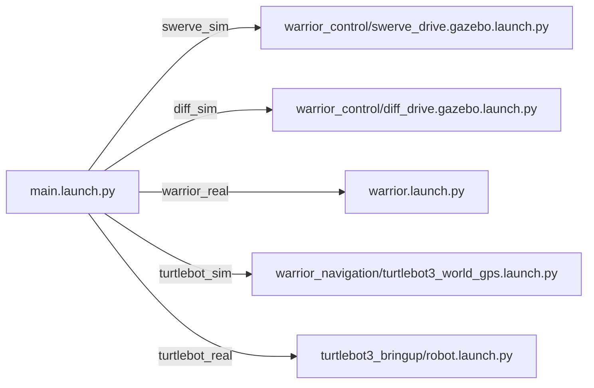
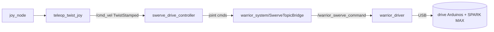

# warrior_bringup

Top-level launchers. Pick a robot type, get a running stack.
See the [workspace README](../README.md) for the whole-system picture.

## Quick Start

| Goal | Command |
|---|---|
| **Drive real swerve (Xbox)** | `ros2 launch warrior_bringup warrior_swerve_teleop.launch.py` |
| Swerve sim | `ros2 launch warrior_bringup swerve_sim.launch.py` |
| Diff-drive sim | `ros2 launch warrior_bringup diff_sim.launch.py` |
| Real Warrior (ros2_control only) | `ros2 launch warrior_bringup warrior_real.launch.py` |

## Launch files

All `*_sim` / `*_real` wrappers just pre-set `robot_type` on `main.launch.py`.

| File | Starts | Sim/Real |
|---|---|---|
| [warrior_swerve_teleop.launch.py](launch/warrior_swerve_teleop.launch.py) | **one-shot real teleop** — RSP, `ros2_control_node` (SwerveTopicBridge HW), joint_state_broadcaster → swerve_drive_controller, `warrior_driver`, joy + teleop_twist_joy | real |
| [main.launch.py](launch/main.launch.py) | dispatcher — branches on `robot_type` (see matrix) | both |
| [swerve_sim.launch.py](launch/swerve_sim.launch.py) | `main` w/ `robot_type:=swerve_sim` | sim |
| [diff_sim.launch.py](launch/diff_sim.launch.py) | `main` w/ `robot_type:=diff_sim` | sim |
| [warrior_real.launch.py](launch/warrior_real.launch.py) | `main` w/ `robot_type:=warrior_real` | real |
| [turtlebot_sim.launch.py](launch/turtlebot_sim.launch.py) | `main` w/ `robot_type:=turtlebot_sim` | sim |
| [turtlebot_real.launch.py](launch/turtlebot_real.launch.py) | `main` w/ `robot_type:=turtlebot_real` | real |
| [warrior.launch.py](launch/warrior.launch.py) | standalone: RSP + `ros2_control_node` + **diff_drive_controller** + rviz + keyboard teleop (loads `warrior_controllers.yaml` — see staleness note) | real |
| [warrior.gazebo.launch.py](launch/warrior.gazebo.launch.py) | DEPRECATED — controller launch + joy + teleop_twist_joy | sim |
| [warrior.real.launch.py](launch/warrior.real.launch.py) | unused variant of teleop (driver include commented out) | real |

> `warrior_real` (via `main`) calls `warrior.launch.py` — **not** the teleop
> file. For Xbox swerve driving use `warrior_swerve_teleop.launch.py` directly.

### main.launch.py dispatch



### main.launch.py arguments

| Arg | Default | Choices |
|---|---|---|
| `robot_type` | `swerve_sim` | `swerve_sim`, `diff_sim`, `warrior_real`, `turtlebot_sim`, `turtlebot_real` |
| `world_name` | `competition.world` | any `.world` (swerve world dir = warrior_gazebo) |
| `use_sim_time` | `true` | `true`, `false` |
| `namespace` | (empty) | string (multi-robot) |

## Real swerve teleop pipeline



- OWNS `warrior_driver` — do **not** start the driver / `steer_calibration_node` separately.
- Prereqs: 12 V on, ~7 `/dev/ttyACM*` connected, steering calibrated, **Xbox pad paired before launch** (joy_node blocks).
- Pad mapping + deadman/turbo: `warrior_joy/config/joystick.yaml`.
- Description: `warrior.urdf.xacro` (real SwerveTopicBridge HW); controllers: `warrior_control/config/warrior_controllers_real.yaml`.

## Config

| File | Used by |
|---|---|
| [config/warrior_bridge.yaml](config/warrior_bridge.yaml) | swerve gazebo gz↔ros bridge (clock, lidar, gps, camera, imu, odom) |
| [config/diff_gz_bridge.yaml](config/diff_gz_bridge.yaml) | diff-drive gz bridge |
| [config/swerve_gz_bridge.yaml](config/swerve_gz_bridge.yaml) / [swerve_rosgz_bridge.yaml](config/swerve_rosgz_bridge.yaml) | per-joint gz cmd_vel bridges (legacy) |

rviz configs in [rviz/](rviz/): `warrior.gazebo.rviz`, `warrior.real.rviz`, `turtle_nav.rviz`.

## Launch on boot (systemd)

Helper scripts live in [scipts/](scipts/) (**dir name is misspelled** — `scipts`, not `scripts`):

- [scipts/on_start.sh](scipts/on_start.sh) — sources ROS + ws, sets `ROS_DOMAIN_ID=30`, `exec ros2 launch … warrior_swerve_teleop.launch.py`.
- [scipts/launch_gazebo.sh](scipts/launch_gazebo.sh) — software-GL Gazebo launch (`world_name` arg).

Example unit (`/etc/systemd/system/warrior-2026.service`):

```ini
[Service]
Type=simple
User=fire
Environment=ROS_DOMAIN_ID=30
ExecStart=/home/fire/ros2_ws/src/Warrior_2026/warrior_bringup/scipts/on_start.sh
Restart=on-failure
```

```bash
sudo systemctl enable --now warrior-2026.service
journalctl -u warrior-2026.service -f
```

> **Gotchas:**
> - The `scipts/` dir is **not installed** by [CMakeLists.txt](CMakeLists.txt) (only `launch`, `config`, `rviz` are). Point the unit at the source path as above.
> - Xbox pad must be paired before the service starts (joy_node blocks).

## Troubleshooting

| Symptom | Fix |
|---|---|
| `Resource not found: warrior_control` | `source install/setup.bash` |
| Teleop sends nothing | controller subscribes `/cmd_vel` as **TwistStamped** — confirm `publish_stamped_twist: true` |
| Xbox does nothing | hold the deadman/enable button (`warrior_joy/config/joystick.yaml`) |
| Gazebo OGRE crash on WSL2 | already patched (`--render-engine ogre`) |
