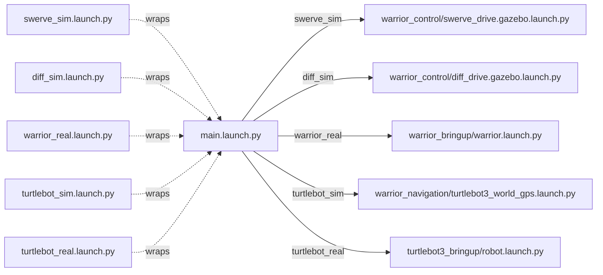

# warrior_bringup

Top-level launchers for the Warrior 2026 robot. Pick a robot type, get a
running stack. See the [workspace README](../README.md) for how this package
fits into the rest of the repo.

## Quick start

```bash
ros2 launch warrior_bringup swerve_sim.launch.py        # sim, swerve, IGVC world
ros2 launch warrior_bringup diff_sim.launch.py          # sim, diff drive, empty world
ros2 launch warrior_bringup warrior_real.launch.py      # real Warrior hardware
ros2 launch warrior_bringup turtlebot_sim.launch.py     # sim TurtleBot3 + GPS
ros2 launch warrior_bringup turtlebot_real.launch.py    # real TurtleBot3
```

Each of the above is a thin wrapper around `main.launch.py` that pre-sets
`robot_type`. Use `main.launch.py` directly if you want full control:

```bash
ros2 launch warrior_bringup main.launch.py \
    robot_type:=swerve_sim \
    world_name:=competition.world \
    use_sim_time:=true
```

## Launch matrix



## `main.launch.py` arguments

| Arg | Default | Options |
|---|---|---|
| `robot_type` | `swerve_sim` | `swerve_sim`, `diff_sim`, `warrior_real`, `turtlebot_sim`, `turtlebot_real` |
| `world_name` | `competition.world` | any `.world` in [warrior_gazebo/worlds/](../warrior_simulation/warrior_gazebo/) or [warrior_description/worlds/](../warrior_description/worlds/) |
| `use_sim_time` | `true` | `true`, `false` |
| `namespace` | (empty) | any string — namespaces all topics, for multi-robot |

## Joysticks & add-ons

Joystick, localization, and navigation are launched **separately** so you
can mix and match with any robot type. Examples:

```bash
ros2 launch warrior_joy joy_swerve.launch.py            # swerve joystick
ros2 launch warrior_joy joy_2stick.launch.py            # diff drive joystick
ros2 launch warrior_joy joy_turtle.launch.py            # turtlebot joystick

ros2 launch warrior_localization ekf.launch.py use_sim_time:=true
ros2 launch warrior_navigation costmap.launch.py
ros2 launch warrior_navigation nav2_complex_path.launch.py use_sim:=true
```

## Launch on boot (real hardware)

Systemd unit at `/etc/systemd/system/warrior-2026.service`:

```ini
[Unit]
Description=Warrior 2026 ROS 2 Launch
After=network.target bluetooth.service

[Service]
Type=simple
User=fire
Environment=ROS_DOMAIN_ID=30
ExecStart=/home/fire/ros2_ws/src/Warrior_2026/warrior_bringup/scripts/on_start.sh
Restart=on-failure
RestartSec=5
StandardOutput=journal
StandardError=journal

[Install]
WantedBy=multi-user.target
```

```bash
sudo systemctl daemon-reload
sudo systemctl enable --now warrior-2026.service
journalctl -u warrior-2026.service -f
```

> The Xbox controller must be paired before the service starts, or `joy_node`
> blocks waiting for it. The motor manager retries USB discovery, so swerve
> Arduinos can be plugged in after boot.

## Troubleshooting

| Symptom | Fix |
|---|---|
| `Resource not found: warrior_control` | `source install/setup.bash` |
| `Cannot find file […]/worlds/<name>.world` | Check it exists in [warrior_gazebo/worlds/](../warrior_simulation/warrior_gazebo/) |
| Gazebo crashes with `OGRE … UnimplementedException` on WSL2 | Already patched: launchers pass `--render-engine ogre` |
| Teleop sends no commands | Check `ros2 node list \| grep teleop` and confirm `cmd_vel` remap matches your controller (`/swerve_drive_controller/cmd_vel`, `/diff_drive_controller/cmd_vel`, or `/cmd_vel`) |
