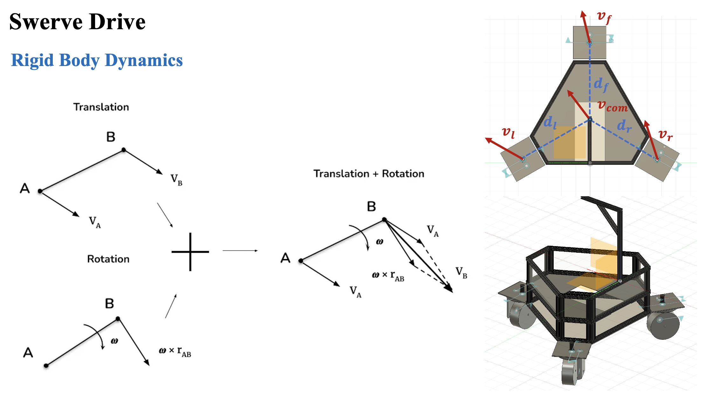
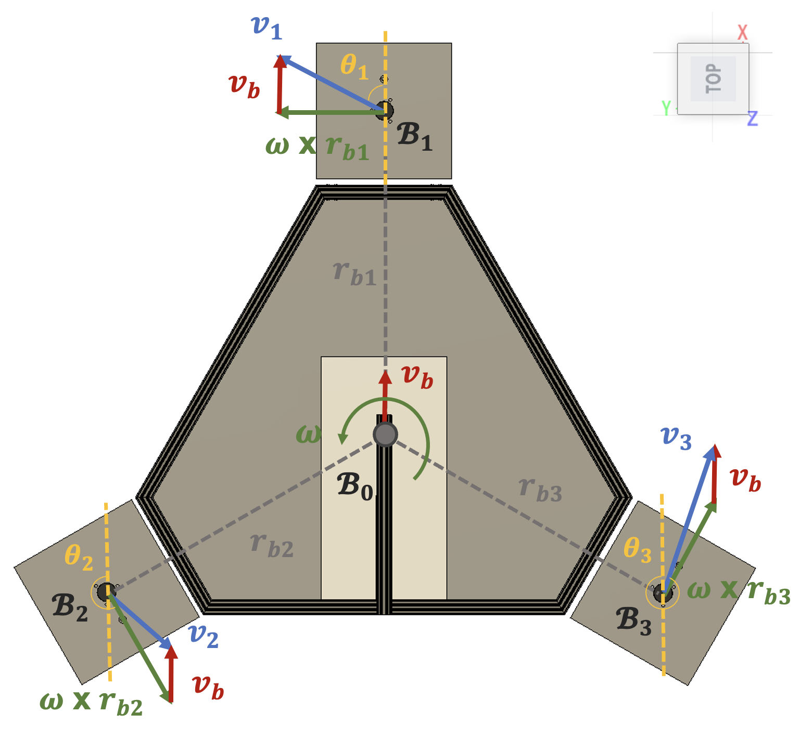

# Warrior Control

A ROS 2 control package implementing swerve drive kinematics for a three-wheel omnidirectional warrior robot.

## Overview

This module provides inverse and forward kinematics solutions for a three-wheel swerve drive system, enabling omnidirectional movement with independent wheel steering and velocity control.

### Features
- ✅ Inverse kinematics: Convert body velocity ($v_x$, $v_y$, $\omega_z$) to wheel commands
- ✅ Forward kinematics: Calculate odometry from wheel states
- ✅ Configurable wheel geometry and constraints
- ✅ Real-time velocity control interface

## Principle

The swerve drive kinematics is derived from rigid body dynamics principles.

### Rigid Body Dynamics

<p align="center">
  
 <br><b>Fig 1. Rigid Body Dynamics</b>
</p>

For a rigid body moving in 2D space, the velocity at any point can be expressed as:

$$
\mathbf{v}_i = \mathbf{v}_{center} + \boldsymbol{\omega} \times \mathbf{r}_i
$$

where:
- $\mathbf{v}_i$: velocity of wheel $i$
- $\mathbf{v}_{center}$: linear velocity of robot center
- $\boldsymbol{\omega}$: angular velocity of the robot
- $\mathbf{r}_i$: position vector from center to wheel $i$

### Inverse Kinematics

<p align="center">
  
 <br><b>Fig 2. Inverse Kinematics for Warrior</b>
</p>

Given the desired base twist $[\mathbf{v}_b,\ \boldsymbol{\omega}]$, the relationship between the robot base motion and each swerve module can be obtained through inverse kinematics as:

$$
\mathbf{v}_i = \mathbf{v}_b + \boldsymbol{\omega} \times \mathbf{r}_{bi}, \qquad i \in \\{1,2,3\\}
$$


where $v_b = [v_{bx}, v_{by}, 0]^T$ denotes the linear velocity of the robot base, $\boldsymbol{\omega} = [0,0,\omega_z]^T$ is the angular velocity of the base, and $v_i = [v_{ix}, v_{iy}, 0]^T$ is the velocity of the $i$-th swerve module. The vector $r_{bi} = [r_{ix}, r_{iy}, 0]^T$ represents the position vector from the robot base to the corresponding swerve module. Accordingly, the kinematic relationship can be expressed in matrix form as:

$$
\begin{bmatrix}
v_{ix} \\
v_{iy}
\end{bmatrix} =
\begin{bmatrix}
1 & 0 & -r_{iy} \\
0 & 1 & r_{ix}
\end{bmatrix}
\begin{bmatrix}
v_{bx} \\
v_{by} \\
\omega_z
\end{bmatrix},
\qquad
i \in \\{1,2,3\\}
$$

By inverse kinematics, The desired driving velocity and steering angle for each swerve module are given by:

$$
\|v_i\|_2 =
\sqrt{v_{ix}^2 + v_{iy}^2},
\qquad
i \in \\{1,2,3\\}
$$

$$
\theta_i =
\mathrm{atan2}(v_{iy}, v_{ix}),
\qquad
i \in \\{1,2,3\\}
$$

where $\|\mathbf{v}_i\|_2$ is the desired rotational speed of the driving wheel, and $\theta_i$ is the desired steering angle of the corresponding steering motor.

## Usage

### Dependencies
```bash
rosdep install --from-paths src --ignore-src -r -y
```

### Build
```bash
colcon build --packages-select warrior_control
source install/setup.bash
```

### Launch
```bash
ros2 launch warrior_control warrior_control.launch.py
```

### Configuration

Edit `config/warrior_params.yaml` to configure:
- Wheel positions relative to robot center
- Maximum wheel velocities and accelerations
- Control loop frequency

### API

**Subscribed Topics:**
- `/cmd_vel` (geometry_msgs/Twist): Desired robot velocity

**Published Topics:**
- `/odom` (nav_msgs/Odometry): Robot odometry

## 📝 References

[1] Wheeled Mobile Robot Kinematics. Available at: https://control.ros.org/rolling/doc/ros2_controllers/doc/mobile_robot_kinematics.html

[2] Using Inverse Kinematics to become a Master-Swerver. Available at: https://abhinavwastaken.medium.com/using-inverse-kinematics-to-become-a-master-swerver-1026759d81b0

[3] Lynch, K. M. and Park, F. C. (2017). *Modern Robotics: Mechanics, Planning, and Control*. Cambridge University Press.