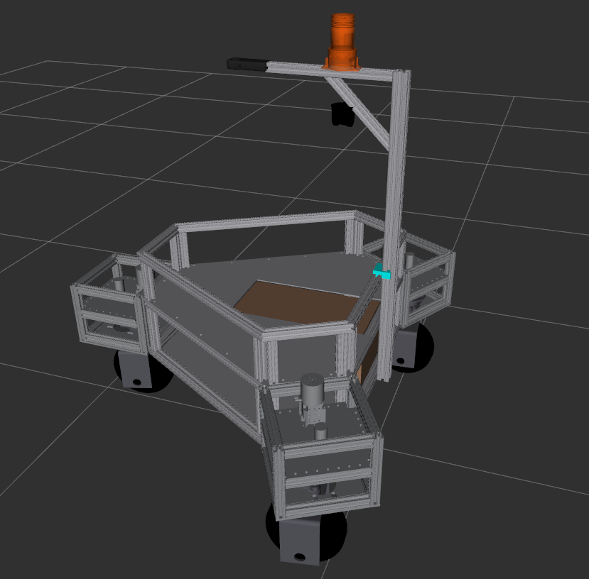
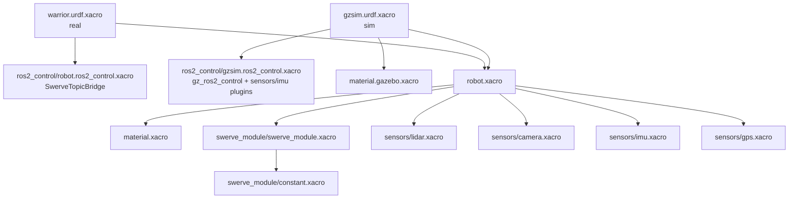

# warrior_description

URDF / xacro / meshes for the 2026 WSU Warrior swerve robot. See the
[workspace README](../README.md) for how this fits the stack.

## Quick start

```bash
colcon build --packages-up-to warrior_description --symlink-install
source ~/ros2_ws/install/setup.bash
ros2 launch warrior_description display.launch.py     # RViz + joint_state_publisher_gui
```

<p align="center"></p>

## Two top-level descriptions

| URDF entry | Adds | Used by |
|---|---|---|
| [urdf/warrior.urdf.xacro](urdf/warrior.urdf.xacro) | **real** HW: `warrior_system/SwerveTopicBridge` ros2_control | real teleop / real launch |
| [urdf/gzsim.urdf.xacro](urdf/gzsim.urdf.xacro) | gazebo: `gz_ros2_control` + gz materials/sensors plugins | sim launches, `display.launch.py` |

Both include the shared body [xacro/robot.xacro](xacro/robot.xacro); they differ
only in the ros2_control layer + gazebo extras.

## Xacro include tree



> [xacro/inertial_macros.xacro](xacro/inertial_macros.xacro) (inertial_box /
> sphere / cylinder) and [xacro/diff_wheels.urdf.xacro](xacro/diff_wheels.urdf.xacro)
> exist but are **not** included by the swerve tree (legacy / diff-drive).

## robot.xacro structure

- `base_footprint` → `base_link` (warrior_body.stl) → `payload_link`, `pole_link`, `beacon_light_link`.
- 3× [swerve_module](xacro/swerve_module/swerve_module.xacro) via `xacro:swerve_module` macro at front / left / right plates (120° apart):
  - links: `${p}_slewing_plate_link` → `${p}_steer_assembly_link` → drive wheel.
  - joints: `${p}_steer_joint` (continuous, z-axis), `${p}_drive_joint` (continuous).
- Sensors mounted on `pole_link` (see table below).

## Joints exposed to ros2_control

`{front,left,right}_steer_joint` (position) and `{front,left,right}_drive_joint`
(velocity) — must match `warrior_control` configs.

## Sensors (gazebo)

| Sensor | gz type | gz topic | frame |
|---|---|---|---|
| LiDAR | `gpu_lidar` | `L1_lidar/scan` | `L1_lidar_link` |
| Camera | `camera` | `/camera/image_raw` (+ `/camera/camera_info`) | `camera_link` |
| IMU | `imu` | `imu` (+ odom `/odom_gt`) | `imu_link` |
| GPS | `navsat` | `navsat` | `navsat_link` |

gz↔ROS bridging is owned by `warrior_bringup` bridge yamls, not here.
[config/gazebo_bridge.yaml](config/gazebo_bridge.yaml) (clock + `/odom`) is the
local copy.

## Meshes

[meshes/](meshes/) (STL): `warrior_body`, `slewing_plate`, `steer_assembly`,
`drive_wheel`, `payload`, `beacon_light`, `insta360_camera`, `unitree_lidar`.

## Launch / config

| File | Purpose |
|---|---|
| [launch/display.launch.py](launch/display.launch.py) | RSP + joint_state_publisher_gui + RViz; args `model`, `use_gui`, `rvizconfig` |
| [rviz/warrior_urdf.rviz](rviz/warrior_urdf.rviz) | display rviz config |

## Notes / staleness

- `gzsim.ros2_control.xacro` hardcodes the sim controller config path
  `$(find warrior_control)/config/warrior_controllers_sim.yaml`.
- [CMakeLists.txt](CMakeLists.txt) installs `launch urdf meshes xacro rviz` but
  **not** `config/` or `docs/` — `config/gazebo_bridge.yaml` isn't installed
  (the live bridge yamls live in `warrior_bringup`, so this is harmless).
- `urdf/robot/*.urdf`, `urdf/warrior*.urdf`, `urdf/turtlebot3_burger_gps.urdf`
  are pre-generated / legacy static URDFs, not produced by the current xacro tree.
