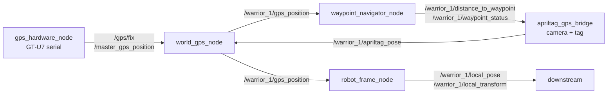

# warrior_gps

GPS + AprilTag fusion. Provides a global position fix for the robot — from real
GPS hardware (outdoor), AprilTag-derived pseudo-GPS (indoor), or fixed coords.

> The real ROS package lives in the **nested** ament_python package
> [`gps_localization/`](gps_localization/). The loose `*.py` files at the
> `warrior_gps/` top level are **stale duplicates** (no `package.xml` / `setup.py`
> here) — see [Staleness](#staleness).

## Data flow



`<robot>` = `warrior_1` (the `robot_name` param). Topics are namespaced per robot.

## Nodes ([gps_localization/gps_localization/](gps_localization/gps_localization/))

| Executable | Source | Role |
|---|---|---|
| `gps_hardware_node` | [gps_hardware_node.py](gps_localization/gps_localization/gps_hardware_node.py) | Reads GT-U7 GPS over serial (NMEA via `pynmea2`). Outdoor only. |
| `apriltag_gps_bridge` | [apriltag_gps_bridge.py](gps_localization/gps_localization/apriltag_gps_bridge.py) | Detects AprilTags (`pupil_apriltags` + OpenCV), emits a pose. Indoor pseudo-GPS. |
| `world_gps_node` | [world_gps_node.py](gps_localization/gps_localization/world_gps_node.py) | Hybrid: real GPS, fixed coords, or AprilTag pose → world GPS fix. |
| `waypoint_navigator_node` | [waypoint_navigator_node.py](gps_localization/gps_localization/waypoint_navigator_node.py) | GPS → UTM (zone 17), tracks distance to next waypoint, advances waypoints. Node name `waypoint_navigator`. |
| `robot_frame_node` | [robot_frame_node.py](gps_localization/gps_localization/robot_frame_node.py) | Tracks robot pose in its local start frame. |

Non-node helper scripts (not in `console_scripts`, not launched):
[`camera_detect.py`](gps_localization/gps_localization/camera_detect.py) (list cameras),
[`camera_test.py`](gps_localization/gps_localization/camera_test.py) (preview one).

## Topics

| Node | Pub | Sub |
|---|---|---|
| `gps_hardware_node` | `/gps/fix`, `/master_gps_position` (NavSatFix) | — |
| `apriltag_gps_bridge` | `/<robot>/apriltag_pose` (PoseStamped) | `/<robot>/gps_position`, `/<robot>/distance_to_waypoint`, `/<robot>/waypoint_status` |
| `world_gps_node` | `/<robot>/gps_position`, `/gps_reference` (NavSatFix) | `/<robot>/apriltag_pose`, `/master_gps_position` |
| `waypoint_navigator_node` | `/<robot>/distance_to_waypoint` (Float32), `/<robot>/waypoint_status` (String) | `/<robot>/gps_position` |
| `robot_frame_node` | `/<robot>/local_pose` (PoseStamped), `/<robot>/local_transform` (TransformStamped) | `/<robot>/apriltag_pose` |

## Launch — [gps_localization.launch.py](gps_localization/launch/gps_localization.launch.py)

```bash
ros2 launch gps_localization gps_localization.launch.py mode:=indoor   # outdoor | indoor | gazebo
```

`mode` selects the source node, always-on: `robot_frame_node`, `world_gps_node`,
`waypoint_navigator_node`.

| `mode` | Source node started |
|---|---|
| `outdoor` (default) | `gps_hardware_node` |
| `indoor` | `apriltag_gps_bridge` |
| `gazebo` | `simulated_gps_node` ⚠️ **not built** (no such entry point) |

## Config — [gps_config.yaml](gps_localization/config/gps_config.yaml)

| Key | Default | Note |
|---|---|---|
| `robot_name` | `warrior_1` | topic namespace |
| `world_gps_node.use_hardware_gps` | `false` | false ⇒ fixed lat/lon/alt |
| `world_gps_node.fixed_*` | Detroit coords | indoor reference fix |
| `apriltag_gps_bridge.camera_parameters` | `[fx, fy, cx]` | intrinsics |
| `waypoint_navigator.utm_zone` | `17` | Detroit UTM zone |
| `waypoint_navigator.waypoint_tolerance` | `0.3` m | arrival radius |
| `waypoint_navigator.waypoint_N_lat/lon` | — | 4 waypoints |

## Staleness

- **Loose top-level `*.py`** (`world_gps_node.py`, `robot_frame_node.py`,
  `apriltag_gps_bridge.py`): duplicates of nested files, content differs, not
  packaged. Treat as dead — edit the [nested](gps_localization/gps_localization/) ones.
- **`simulated_gps_node`**: referenced by the launch `gazebo` mode but has no
  source file and no `console_scripts` entry — `mode:=gazebo` will fail.
- `package.xml` description/maintainer/license are TODO placeholders.
