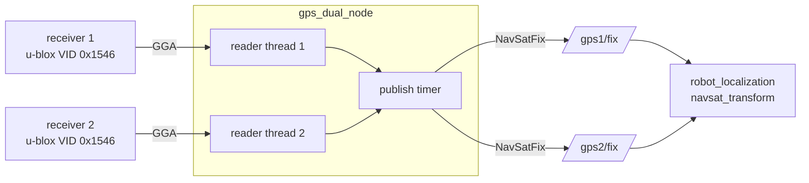

# warrior_gps_dual

Dual u-blox NMEA GPS driver. Two receivers → **two independent
`sensor_msgs/NavSatFix` topics**. No averaging here — the EKF
([warrior_localization](../warrior_localization/)) fuses them.

## Hardware

- vfan USB GPS — u-blox **UBX-G70xx** (USB VID `0x1546`)
- USB CDC-ACM (`/dev/ttyACM*`) — **auto-discovered by VID**, not pinned
- **9600 baud**, NMEA-0183 @ 1 Hz (parses `GPGGA`/`GNGGA`)
- Two identical receivers, read in parallel

> **Port discovery.** The robot already has ~7 `/dev/ttyACM*` devices (swerve
> Arduinos + SPARK MAXes), so the node finds the receivers by USB VID rather
> than a fixed number (CLAUDE.md rule 1). Override with the `port1` / `port2`
> params only if needed — prefer a stable `/dev/serial/by-id/...` path.

## Data flow



One reader thread per port keeps the latest fix under a lock; a timer reads both
and publishes. Threads reconnect on serial error (unplug / late enumerate).

## Topics

| Topic | Type | Notes |
|---|---|---|
| `/gps1/fix` | `sensor_msgs/NavSatFix` | receiver 1 |
| `/gps2/fix` | `sensor_msgs/NavSatFix` | receiver 2 |
| `/gps1/nmea`, `/gps2/nmea` | `std_msgs/String` | raw GGA (if `publish_nmea`) |

- `status.status`: `1`→`STATUS_FIX`, `2`→`STATUS_SBAS_FIX` (DGPS/WAAS), `4/5`→`STATUS_GBAS_FIX`.
- `altitude` = MSL (GGA field 9) + geoid separation (field 11) → WGS-84 ellipsoid height.
- `position_covariance` ≈ `(hdop · 2.5 m)²` on E/N, `×2.25` on up; `COVARIANCE_TYPE_APPROXIMATED`.

## Parameters — [config/gps_dual.yaml](config/gps_dual.yaml)

| Name | Default | Description |
|---|---|---|
| `port1` / `port2` | `""` (auto-discover) | override serial ports; empty = find by VID |
| `baud` | `9600` | serial baud |
| `frame_id1` / `frame_id2` | `gps1` / `gps2` | `NavSatFix` header frame |
| `publish_rate` | `1.0` | Hz (GPS is 1 Hz; no point going faster) |
| `publish_nmea` | `true` | also republish raw GGA |

## Build & run

```bash
cd ~/ros2_ws
colcon build --packages-select warrior_gps_dual
source install/setup.bash

ros2 launch warrior_gps_dual gps_dual.launch.py    # auto-discovers both receivers
# override a port only if discovery picks wrong (prefer by-id):
ros2 run warrior_gps_dual gps_dual_node --ros-args \
  -p port1:=/dev/serial/by-id/usb-u-blox_...-if00

ros2 topic hz /gps1/fix      # ~1.0 Hz
ros2 topic echo /gps1/fix
```

User must be in the `dialout` group: `sudo usermod -aG dialout $USER` (re-login).

## SBAS / WAAS (one-time, per receiver)

Receivers ship with SBAS off. Enabling it lifts fix quality `GPS`→`DGPS`
(~2-5 m → ~1-3 m). Flashes to battery-backed RAM, persists across power cycles:

```bash
# auto-detects a single u-blox port; pass one explicitly if both are plugged in
ros2 run warrior_gps_dual enable_waas /dev/serial/by-id/usb-u-blox_...-if00
```

Run it once per receiver. Allow 30-60 s for WAAS acquisition (PRN 135/138 over
the US); `status.status` then reads `STATUS_SBAS_FIX` (2).

## Targets

| | ROS 2 | Ubuntu | Arch |
|---|---|---|---|
| Primary | Humble | 22.04 | ARM (RPi 4 / Jetson) |
| Test | Jazzy | 24.04 | x86-64 |
