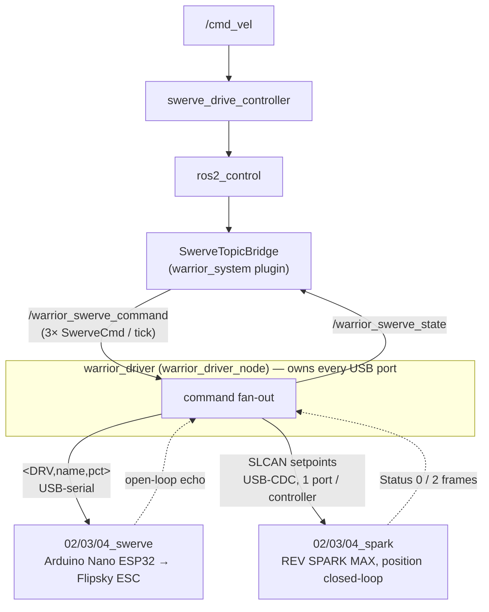

# warrior_hardware

Real-robot hardware stack: a ros2_control `SystemInterface` plugin + a single
C++ node that owns every USB connection.

- Steer position → REV SPARK MAX controllers over **USB-SLCAN**.
- Drive velocity → swerve Arduinos as ASCII **`<DRV,…>`** frames over USB-serial.

See [../CLAUDE.md](../CLAUDE.md) for USB auto-connect rules, and
[../CHANGES.md](../CHANGES.md) for the byte-level SLCAN war stories.

## Architecture



## Packages

| Package | Lang | Role |
|---|---|---|
| [warrior_driver/](warrior_driver/) | C++ | One node (`warrior_driver_node`), one process. Owns USB discovery + reconnect, fans `SwerveCmd` to drive Arduinos and SPARK MAXes, drains feedback, auto-calibrates steer on startup. |
| [warrior_system/](warrior_system/) | C++ | ros2_control `SystemInterface` plugin (`warrior_system/SwerveTopicBridge`). Bridges joint command/state interfaces ↔ `/warrior_swerve_command` & `/warrior_swerve_state`. See its [README](warrior_system/README.md). |

> Dev/debug Python helpers (SLCAN reference) live in
> [warrior_driver/scripts/](warrior_driver/scripts/) — they are run directly
> with `python3`, not installed as ROS executables.

## Topics

| Topic | Type | Direction | Notes |
|---|---|---|---|
| `/warrior_swerve_command` | `warrior_msgs/SwerveCmd` | bridge → driver | One per module per tick. `swerve_id ∈ {front,left,right}`, `steer_position_rad`, `drive_velocity_rad_s`. |
| `/warrior_swerve_state` | `warrior_msgs/SwerveState` | driver → bridge | One per module at update rate. Drive velocity is the **commanded** value echoed back (open-loop, no drive encoder); steer position/velocity come from SPARK MAX Status 2 / Status 1. |
| `/diagnostics` | `diagnostic_msgs/DiagnosticArray` | driver → * | Per-module + per-transport up/down, at `diagnostics_rate_hz` (default 1 Hz). |

Topic names are params (`command_topic` / `state_topic`); see
[warrior_driver.yaml](warrior_driver/config/warrior_driver.yaml).

## Devices

| Logical name | Transport | Discovered by |
|---|---|---|
| `02_swerve`, `03_swerve`, `04_swerve` | USB-serial ASCII | `<WHO>` → `<NAME,…>` handshake |
| `02_spark`, `03_spark`, `04_spark` | USB-SLCAN, **one port per controller** | VID:PID `0x0483:0xa30e` filter, then passive read of low 6 bits of any inbound CAN ID |

Each SPARK MAX is its own SLCAN-over-USB endpoint — no shared CAN bus / external
adapter. Logical-name ↔ CAN-id ↔ Arduino-name mapping lives under
`modules.<name>` (`drive_device_name`, `steer_device_name`, `spark_can_id`) in
[warrior_driver.yaml](warrior_driver/config/warrior_driver.yaml).

## Wire protocol

### Drive Arduinos

ASCII, `\n`-terminated, `<TYPE,...>` framing
([serial_protocol.hpp](warrior_driver/include/warrior_driver/arduino/serial_protocol.hpp)):

| Direction | Frame | Meaning |
|---|---|---|
| host → arduino | `<WHO>` | Identify. Reply `<NAME,XX_swerve>`. |
| host → arduino | `<DRV,XX_swerve,pct>` | Drive cmd, `pct ∈ −100..100`, filtered per `name`. Ack `<ACK,DRV,XX_swerve>`. |
| arduino → host | `<ERR,reason>` | Bad / unsupported frame. |

Watchdog: a swerve with no matching `<DRV,…>` for 500 ms returns to 0 %
(neutral PWM) → drive commands must be sent at ≥ 2 Hz.

### SPARK MAX (SLCAN over USB-CDC)

Per-controller USB port speaking CANable-style SLCAN ASCII
(`T<8-hex-id><1-hex-dlc><N*2-hex-bytes>\r`). Byte-exact helpers in
[sparkmax_frame.hpp](warrior_driver/include/warrior_driver/sparkmax/sparkmax_frame.hpp);
see [../CHANGES.md](../CHANGES.md) for the history behind each.

| Frame | Bytes | Purpose |
|---|---|---|
| **Channel open** | `S8\rO\r` | Adapter cmd (not a CAN frame). Cold SPARK MAX boots with CAN channel CLOSED — every `T…` is dropped until this is sent once at port open. `SLCAN_OPEN_SEQUENCE`. |
| **Mode bitmask** | `T02052C808<bitmask>00000000000000\r` | Enables controllers to follow setpoints. Byte 0 is a **device-id bitmask** `(1 << device_id)`, OR-able — **not** a control-mode enum. `make_mode_frame()`. |
| **Enable** | `T000502C0101\r` | FRC-style enable heartbeat (broadcast). `ENABLE_FRAME`. |
| **Telemetry enable** | id `0x02050400 \| can_id`, dlc 4, `7C 00 FF FF` | One-time: turns on Status 2-6 (position) on a cold controller. `make_enable_telemetry_frame()`. |
| **Position setpoint** | id `0x02050100 \| can_id`, `float32_le(rot) + float32_le(0)` | api_class 0, api_index 4. `encode_arbitration_id()` + `encode_position_payload()`. |

Mode + enable are sent every tx tick (~50 Hz). Status frames decoded as
api_class `0x2E`: **Status 0** = applied output + faults (offset 0..3),
**Status 1** = velocity, **Status 2** = position float32 at payload offset **4**.

## Build & run

```bash
cd ~/ros2_ws
colcon build --packages-up-to warrior_driver warrior_system --symlink-install
source install/setup.bash

# Driver alone (owns USB connections; auto-calibrates steer on startup):
ros2 launch warrior_driver warrior_driver.launch.py

# Full real-robot stack — driver + controller_manager + bridge in 2 terminals:
ros2 launch warrior_control swerve_drive.real.launch.py
ros2 launch warrior_driver warrior_driver.launch.py

# One-shot Xbox teleop (controller + bridge + driver + joystick):
ros2 launch warrior_bringup warrior_swerve_teleop.launch.py
```

> The one-shot teleop launch **owns** `warrior_driver` — don't also start the
> driver separately. See
> [warrior_bringup/README.md](../warrior_bringup/README.md).

## Steer calibration (automatic on startup)

There is **no** separate calibration node — `warrior_driver_node` self-calibrates
each launch. On startup it gates normal operation until every module's forward
encoder offset is recorded
([swerve_driver_node.cpp](warrior_driver/src/swerve/swerve_driver_node.cpp) →
`auto_calibrate()`).

Per module, the node:

1. Waits for the SPARK MAX (`spark_can_id`) to connect and stream fresh Status 2.
2. Averages `calib.samples` raw encoder readings (default 100).
3. Stores the mean as `encoder_pos_forward` (warns if stddev > 0.1 rot — wheel moved).

When all modules are recorded it writes
[steer_calibration.yaml](warrior_driver/config/steer_calibration.yaml) (path =
`calib.write_path`) and enters normal operation. If a module never connects
within `calib.timeout_s` (default 60 s) it logs FATAL and shuts down.

| Param | Default | Meaning |
|---|---|---|
| `calib.samples` | 100 | Encoder readings averaged per module |
| `calib.timeout_s` | 60 | Hard deadline for all modules to connect |
| `calib.write_path` | (set by launch) | Where the calibration YAML is written |

### Calibration procedure

1. Power OFF the robot.
2. Physically point ALL wheels STRAIGHT FORWARD (robot +X).
3. Power ON. Launch `warrior_driver` — it calibrates automatically and writes
   `steer_calibration.yaml`, then keeps running.

`steer_calibration.yaml` is auto-loaded after `warrior_driver.yaml` on the next
launch (overriding `encoder_pos_forward`) — **do not hand-edit it**.

### How the offset is used

The driver decodes steering position from raw motor rotations $\theta_{motor}$ as:

$$\theta_{steer} = \frac{(\theta_{motor} + e_{fwd}) / G \cdot 2\pi - \delta}{s}$$

where $G$ = `steer_motor_rot_per_module_rot` (gear ratio), $e_{fwd}$ =
auto-calibrated `encoder_pos_forward`, $\delta$ = `steer_offset_rad`, $s$ =
`steer_sign`. Calibration measures $e_{fwd}$ so the wheel reads 0 when pointing
forward; the remaining per-module trims live in
[warrior_driver.yaml](warrior_driver/config/warrior_driver.yaml).

## SPARK MAX troubleshooting

Dev tools in [warrior_driver/scripts/](warrior_driver/scripts/) (run with
`python3`):

| Tool | What it does |
|---|---|
| `nudge_sparks.py` | Open every detected SPARK MAX, nudge each +5 rot, print live position / applied output / faults. End-to-end wiring + REV-config check. |
| `sniff_usb.py` | usbmon decoder: every SLCAN byte host↔controller. Compare your traffic against REV Hardware Client. |
| `probe_status2.py` | Replay REV's telemetry-enable bytes; verify Status 2 turns on. |
| `wheel_sweep_test.py` | Bench sweep, all modules through 0–360° at 10 % drive — see [WHEEL_SWEEP_TESTPLAN.md](warrior_driver/WHEEL_SWEEP_TESTPLAN.md). |

A C++ equivalent of `nudge_sparks` ships as the `nudge_sparks_cli` executable.

If a SPARK MAX sends **zero** bytes back even with enable frames blasting at it:
12 V not powered; CAN channel closed (missing `S8\rO\r`); Status 0/2 disabled in
REV; or a bad USB cable. See [../CLAUDE.md](../CLAUDE.md) rules 5, 11, 12.
