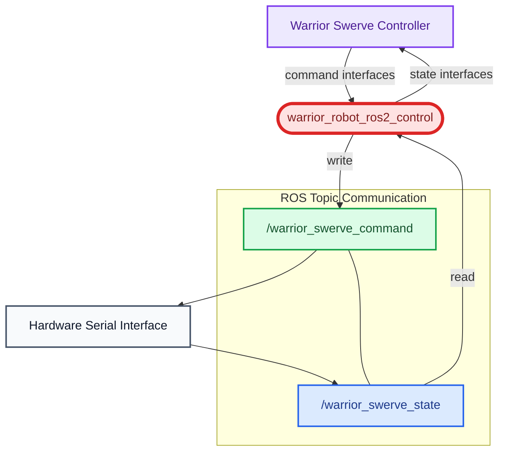

# User Guide

## Warrior System

This package provides a topic-bridge interface for the low-level control layer within the [ros2_control](https://control.ros.org/humble/doc/ros2_control/doc/index.html) framework. Similar to a typical hardware resource manager implementation, the `read()` and `write()` methods are executed at a fixed frequency to communicate with the physical robot hardware.

Unlike traditional implementations that directly interface with hardware drivers in C++, this package introduces ROS topic-based communication as an intermediate layer. Although this design may introduce a small amount of additional latency, it provides significantly greater flexibility for hardware communication and integration. For example, it enables serial communication implementations in Python rather than being restricted to C++ only.



### ros2-control Xacro Configuration
The ros2_control xacro configuration file is located at: [robot.ros2_control.xacro](../../warrior_description/xacro/ros2_control/robot.ros2_control.xacro).

Currently, each swerve module supports the following hardware interfaces:

- **Steering Motor**
  - State interface: `position`
  - Command interface: `position`
- **Driving Motor**
  - State interface: `velocity`
  - Command interface: `velocity`
  
Additional hardware interfaces will be added in future updates to support smoother and more advanced robot control capabilities.


```xml
        <ros2_control name="warrior_robot_ros2_control" type="system">
            <hardware>
                <plugin>warrior_system/SwerveTopicBridge</plugin>
                <param name="joint_commands_topic">/warrior_joint_commands</param>
                <param name="joint_states_topic">/warrior_joint_states</param>
            </hardware>
            <joint name="left_steer_joint">
                <command_interface name="position"/>
                <state_interface name="position"/>
            </joint>
            <joint name="left_drive_joint">
                <command_interface name="velocity"/>
                <state_interface name="velocity"/>
            </joint>
            <joint name="right_steer_joint">
                <command_interface name="position"/>
                <state_interface name="position"/>
            </joint>
            <joint name="right_drive_joint">
                <command_interface name="velocity"/>
                <state_interface name="velocity"/>
            </joint>
            <joint name="front_steer_joint">
                <command_interface name="position"/>
                <state_interface name="position"/>
            </joint>
            <joint name="front_drive_joint">
                <command_interface name="velocity"/>
                <state_interface name="velocity"/>
            </joint>
        </ros2_control>
```