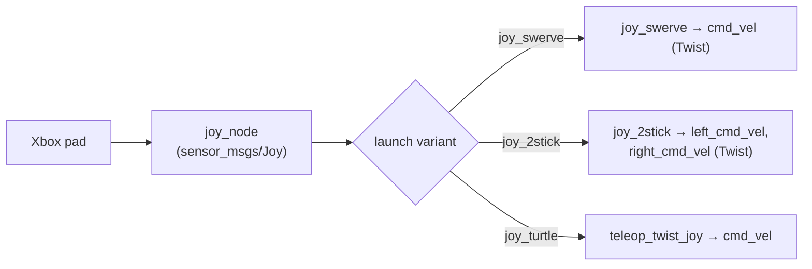

# warrior_joy

Gamepad → `cmd_vel`. Three launch variants for different downstream consumers.
See the [workspace README](../README.md) for context.



## Launchers

| Launcher | Node(s) | Output topic(s) | For |
|---|---|---|---|
| [joy_swerve.launch.py](launch/joy_swerve.launch.py) | `joy_node` + `joy_swerve` | `cmd_vel` (`Twist`) | swerve drive (sim) |
| [joy_2stick.launch.py](launch/joy_2stick.launch.py) | `joy_node` + `joy_2stick` | `left_cmd_vel`, `right_cmd_vel` (`Twist`) | tank/diff (one stick per side) |
| [joy_turtle.launch.py](launch/joy_turtle.launch.py) | `joy_node` + `teleop_twist_joy` | `cmd_vel` | TurtleBot3 / generic teleop |

Topics are relative — remap or namespace at launch to target a controller.

## Nodes

| Node | Mapping | Source |
|---|---|---|
| `joy_swerve` | `axes[1]` → `linear.x`, `axes[4]` → `angular.z` | [joy_swerve.py](warrior_joy/joy_swerve.py) |
| `joy_2stick` | `axes[1]` → left `linear.x`, `axes[4]` → right `linear.x` | [joy_2stick.py](warrior_joy/joy_2stick.py) |

`joy_turtle` uses stock `teleop_twist_joy` driven by
[config/joystick.yaml](config/joystick.yaml).

## Pad mapping (`teleop_twist_joy` / joy_turtle)

From [config/joystick.yaml](config/joystick.yaml):

| Input | Axis/Button | Action |
|---|---|---|
| Left stick Y | `axis_linear.x` = 1 | forward/back (scale 0.25, turbo 0.4) |
| Left stick X | `axis_angular.yaw` = 0 | turn (scale 0.3, turbo 0.5) |
| RB | `enable_button` = 5 | hold to drive (deadman) |
| LB | `enable_turbo_button` = 4 | hold with RB for turbo |

`publish_stamped_twist: true`, `require_enable_button: true`, deadzone 0.15.

```bash
ros2 launch warrior_joy joy_swerve.launch.py
```

> **Real swerve robot:** these `warrior_joy` nodes publish **unstamped**
> `Twist`, but the real `swerve_drive_controller` wants `TwistStamped` on
> `/cmd_vel`. Use the `teleop_twist_joy` path
> (`publish_stamped_twist: true` from `joystick.yaml`), wired end-to-end —
> including `warrior_driver` — by
> [warrior_bringup/launch/warrior_swerve_teleop.launch.py](../warrior_bringup/launch/warrior_swerve_teleop.launch.py).
