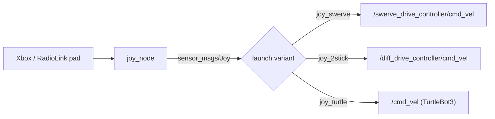

# warrior_joy

Gamepad → `cmd_vel`. Three flavours depending on what's downstream. See the
[workspace README](../README.md) for context.



## Launchers

| Launcher | For | cmd_vel topic |
|---|---|---|
| `joy_swerve.launch.py` | swerve drive (sim or real) | `/swerve_drive_controller/cmd_vel` |
| `joy_2stick.launch.py` | diff drive (sim or real Warrior) | `/diff_drive_controller/cmd_vel` |
| `joy_turtle.launch.py` | TurtleBot3 | `/cmd_vel` |

ToDo: figure out the one Yihao is using and add it here / set it as the defualt

Run alongside any robot launcher from [warrior_bringup](../warrior_bringup/README.md):

```bash
ros2 launch warrior_joy joy_swerve.launch.py
```

Pad mapping is in `config/`. Axes/buttons follow the standard Xbox layout.
