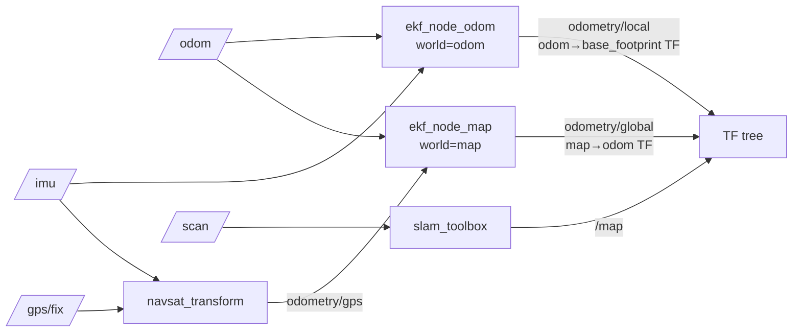

# warrior_localization

Sensor fusion + mapping. Wraps `robot_localization` (EKF + navsat) and
`slam_toolbox`. Outputs filtered odometry, the `map`→`odom`→`base_footprint` TF
chain, and (in SLAM) an occupancy map.

ament_python. Most work is config + launch over upstream nodes; one local node.

## Data flow

EKF runs in two modes: single (odom only) or **dual + navsat** (global GPS-fused).

## Nodes

- No local nodes. Everything is upstream: `robot_localization` (EKF + navsat),
  `slam_toolbox` (mapping).
- The robot pose in the `map` frame is published directly by the localization
  node (the old `map_robot_pose` helper was removed).

## Launch — [launch/](launch/)

| File | Brings up | Notes |
|---|---|---|
| [ekf.launch.py](launch/ekf.launch.py) | one `ekf_node` (`ekf_node_odom`) → `/odometry/filtered` | local odom fusion only. `use_sim_time` arg (default `true`) |
| [dual_ekf_navsat.launch.py](launch/dual_ekf_navsat.launch.py) | `ekf_node_odom` (→`odometry/local`) + `ekf_node_map` (→`odometry/global`) + `navsat_transform` | full GPS-fused stack |
| [online_async_launch.py](launch/online_async_launch.py) | `slam_toolbox/async_slam_toolbox_node` (lifecycle, autostarted) | SLAM mapping. Args: `autostart`, `use_lifecycle_manager`, `use_sim_time`, `slam_params_file` |

## Config — [config/](config/)

### [ekf_config.yaml](config/ekf_config.yaml)
- `ekf_node_odom`: `world_frame=odom`, fuses `odom0=/odom` + `imu0=/imu`, `two_d_mode`, 30 Hz, `publish_tf`.
- `ekf_node_map`: `world_frame=map`, adds `odom1=/odometry/gps`.
- `navsat_transform`: `gps/fix`+`imu`+`odometry/global` → `odometry/gps`; `magnetic_declination_radians=0`, `zero_altitude`, `publish_filtered_gps`, `wait_for_datum=false`.

### [mapper_params_online_async.yaml](config/mapper_params_online_async.yaml)
- slam_toolbox: `mode: mapping` (toggle to `localization`), `scan_topic=/scan`, frames `map`/`odom`/`base_footprint`, `resolution 0.05`.

## Frames

`map` → `odom` (ekf_node_map / slam_toolbox) → `base_footprint` (ekf_node_odom).
Run only **one** map-frame TF publisher at a time (dual-EKF **or** SLAM, not both).

## Notes
- `package.xml` description/maintainer/license are TODO placeholders.
