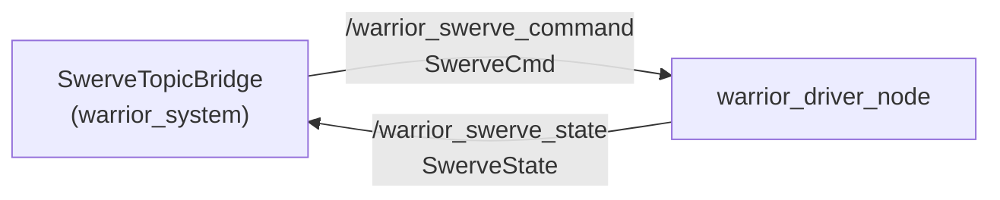

# warrior_msgs

Custom message definitions for the Warrior swerve stack. Built with
`rosidl` ([CMakeLists.txt](CMakeLists.txt)). Two messages, both per-module
(one instance per swerve module per controller tick).

## Messages

### [SwerveCmd](msg/SwerveCmd.msg) — controller → driver

| Field | Type | Meaning |
|---|---|---|
| `swerve_id` | `string` | `"front"` \| `"left"` \| `"right"` |
| `steer_position_rad` | `float64` | Absolute steering angle (rad) |
| `drive_velocity_rad_s` | `float64` | Wheel angular velocity (rad/s) |
| `stamp` | `builtin_interfaces/Time` | Command time |

### [SwerveState](msg/SwerveState.msg) — driver → controller

| Field | Type | Meaning |
|---|---|---|
| `swerve_id` | `string` | `"front"` \| `"left"` \| `"right"` |
| `steer_position_rad` | `float64` | Steering angle from SPARK MAX (Status 2) |
| `steer_velocity_rad_s` | `float64` | Steering angular velocity |
| `drive_position_rad` | `float64` | Drive wheel angle |
| `drive_velocity_rad_s` | `float64` | Drive angular velocity — **open-loop echo of the commanded value** (no drive encoder on the Flipsky ESC) |
| `steer_connected` | `bool` | SPARK MAX link up |
| `drive_connected` | `bool` | Drive Arduino link up |
| `steer_status` | `string` | e.g. `"active"`, `"scanning"`, `"no_feedback"`, `"timeout"` |
| `drive_status` | `string` | drive transport status |
| `stamp` | `builtin_interfaces/Time` | State time |

> `drive_velocity_rad_s` is **not** measured — it echoes the last commanded
> value. Confirmed by the `.msg` comment (open-loop, no encoder).

## Data flow

| Message | Published by | Consumed by |
|---|---|---|
| `SwerveCmd` | [SwerveTopicBridge](../warrior_hardware/warrior_system/src/swerve_topic_bridge.cpp) | [warrior_driver_node](../warrior_hardware/warrior_driver/src/swerve/swerve_driver_node.cpp) |
| `SwerveState` | warrior_driver_node | SwerveTopicBridge |

No legacy messages remain — only `SwerveCmd` and `SwerveState` are defined.
