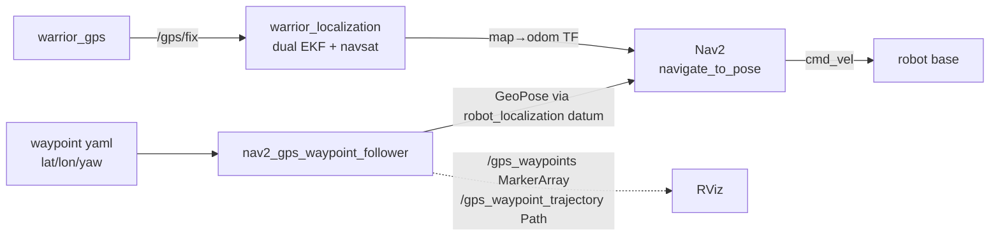

# warrior_navigation

Path planning + GPS waypoint following. Two stacks:

1. **Nav2-based** — Nav2 bringup + a thin GPS waypoint follower (the supported path).
2. **Custom A\*** — in-package planner / recovery / pure-pursuit controller
   (`compute_path_to_pose` + `recovery_manager` + `follow_path`).

ament_python. Heavily simulation-oriented (TurtleBot3 Gazebo) — see [Staleness](#staleness).

## Nav2 GPS waypoint flow



## Launch — [launch/](launch/)

| File | Stack | Notes |
|---|---|---|
| [nav.launch.py](launch/nav.launch.py) | **Nav2** | Main entry. EKF + SLAM + `nav2_bringup` + `nav2_gps_waypoint_follower`. Defaults to `real_waypoints.yaml`, map origin args (lat/lon/yaw, UTM zone/hemisphere). |
| [nav2_gps_waypoint_follower.launch.py](launch/nav2_gps_waypoint_follower.launch.py) | **Nav2** | Gazebo + EKF + SLAM + nav2_bringup + follower. |
| [gps_waypoint_follower.launch.py](launch/gps_waypoint_follower.launch.py) | **custom A\*** | Gazebo + EKF + SLAM + costmap + `path_to_pose_server` + `recovery_manager` + `follow_path` + `gps_waypoint_manager`. |
| [complex_path.launch.py](launch/complex_path.launch.py) | **custom A\*** | Gazebo + EKF + SLAM + costmap + RViz + planner/recovery/follow_path. |
| [nav2_complex_path.launch.py](launch/nav2_complex_path.launch.py) | **Nav2** | Gazebo + EKF + SLAM + nav2_bringup + RViz. |
| [costmap.launch.py](launch/costmap.launch.py) | shared | Standalone global+local `nav2_costmap_2d` + lifecycle manager. |
| [turtlebot3_world_gps.launch.py](launch/turtlebot3_world_gps.launch.py) | sim | TurtleBot3 Gazebo world + spawn. ⚠️ sim-only. |
| [spawn_turtlebot3_gps.launch.py](launch/spawn_turtlebot3_gps.launch.py) | sim | Spawn TB3 burger + gz bridges. ⚠️ sim-only. |

```bash
ros2 launch warrior_navigation nav.launch.py use_sim:=false waypoint_file:=<path>
```

## Nodes — [warrior_navigation/](warrior_navigation/)

| Executable | Source | Role |
|---|---|---|
| `nav2_gps_waypoint_follower` | [nav2_gps_waypoint_follower.py](warrior_navigation/nav2_gps_waypoint_follower.py) | Reads yaml waypoints, sends `NavigateToPose` goals to Nav2; pubs RViz markers/trajectory. |
| `waypoint_follower` | [logged_waypoint_follower.py](warrior_navigation/logged_waypoint_follower.py) | `nav2_simple_commander` `followGpsWaypoints` (BasicNavigator, localizer `robot_localization`). |
| `gps_waypoint_manager` | [gps_waypoint_manager.py](warrior_navigation/gps_waypoint_manager.py) | Custom-stack waypoint mgr; `ComputePathToPose` action **client**; pubs markers/trajectory. |
| `path_to_pose_server` | [compute_path_to_pose.py](warrior_navigation/compute_path_to_pose.py) | A\* planner. `ComputePathToPose` action **server**; subs `/costmap`, pubs `/a_star_path`. |
| `recovery_manager` | [recovery_manager.py](warrior_navigation/recovery_manager.py) | Wraps planner with recovery (clear costmap, replan); `ComputePathToPose` server+client. |
| `follow_path` | [follow_path.py](warrior_navigation/follow_path.py) | Pure-pursuit-style path tracker; subs `a_star_path`, pubs `cmd_vel` (TwistStamped). |

Shared helper: [utils/gps_utils.py](utils/gps_utils.py) (`latLonYaw2Geopose`, quaternion conv).

### Key topics / actions
- `/a_star_path` (Path) — planner output → `follow_path`.
- `/costmap` (OccupancyGrid) — planner input.
- `cmd_vel` (TwistStamped) — `follow_path` output.
- `/gps_waypoints` (MarkerArray), `/gps_waypoint_trajectory` (Path) — RViz viz.
- `ComputePathToPose`, `NavigateToPose` — Nav2 actions.

## Config — [config/](config/)

| File | Purpose |
|---|---|
| [nav2_params.yaml](config/nav2_params.yaml) | Nav2 bringup params. |
| [costmaps_only.yaml](config/costmaps_only.yaml) | Standalone costmap params (costmap.launch.py). |
| [real_waypoints.yaml](config/real_waypoints.yaml) | **Real-robot** GPS waypoints (default for `nav.launch.py`). |
| [practice_waypoints.yaml](config/practice_waypoints.yaml) | Practice-field waypoints. |
| [demo_waypoints.yaml](config/demo_waypoints.yaml) | Demo waypoints. |
| [turtlebot_sim_waypoints.yaml](config/turtlebot_sim_waypoints.yaml) | TB3 Gazebo waypoints. |
| [turtlebot3_burger_gps_bridge.yaml](config/turtlebot3_burger_gps_bridge.yaml) | gz↔ROS bridge for sim. |
| [maps/gz_world_save.yaml](maps/gz_world_save.yaml) | Saved Gazebo-world occupancy map. |

**Waypoint yaml format:**
```yaml
waypoints:
  - {latitude: 42.668212, longitude: -83.218459, yaw: 0.0}
```

## Staleness

- **Broken `console_scripts`** in [setup.py](setup.py): `direct_path_generator`,
  `map_robot_pose`, `linear_path_controller`, `astar_planner` — **no source files
  exist**; `colcon build` installs them but they fail to run.
- [logged_waypoint_follower.py](warrior_navigation/logged_waypoint_follower.py)
  imports `warrior_navigation.gps_utils`, but `gps_utils.py` lives under
  [utils/](utils/) — relies on the install layout flattening it; fragile.
- TurtleBot3 launch files (`turtlebot3_world_gps`, `spawn_turtlebot3_gps`,
  `*complex_path`) are **simulation-only** and need the TB3 Gazebo packages.
- `package.xml` description/maintainer/license are TODO placeholders.
