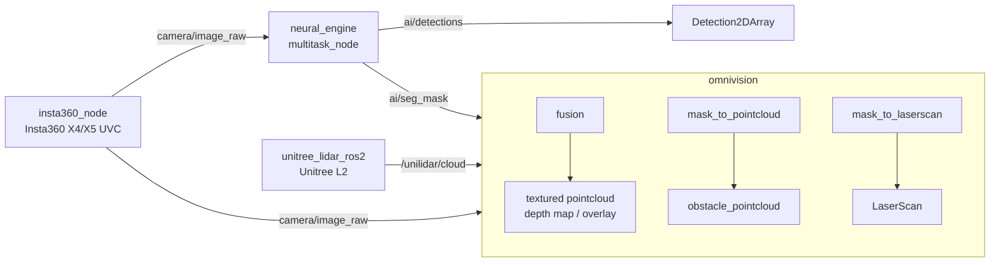

# warrior_perception

Umbrella for Warrior 2026 perception drivers + processing nodes:
360° camera, Unitree L2 LiDAR, neural inference, camera↔LiDAR fusion.

Jetson bring-up / driver / network detail → [PERCEPTION_SETUP.md](PERCEPTION_SETUP.md).

## Sub-packages

| Package | Build | Executable(s) / launch | Purpose |
| --- | --- | --- | --- |
| [unitree_l2_lidar](unitree_l2_lidar/) | `ament_cmake` | `unitree_l2.launch.py` | Launch + config wrapper around upstream `unitree_lidar_ros2_node`. |
| [unilidar_sdk2/](unilidar_sdk2/) | vendored | provides `unitree_lidar_ros2` | Unitree SDK (C++ lib + ROS 2 driver). Cloned from `github.com/unitreerobotics/unilidar_sdk2`. |
| [insta360_camera](insta360_camera/) | `ament_cmake` | `insta360_node` · `insta360.launch.py` | C++ V4L2 driver for Insta360 X4/X5 in UVC/webcam mode → `camera/image_raw`. |
| [neural_engine](neural_engine/) | `ament_cmake` | `multitask_node`, `seg_viz_node` · `multitask.launch.py` | TensorRT multitask net (ResNet18): image → `ai/seg_mask` (lane) + `ai/detections`. Engine is per-Jetson, rebuilt with `trtexec`. |
| [omnivision](omnivision/) | `ament_python` | see node table · `perception.launch.py` | 360° camera + LiDAR fusion: textured clouds, depth maps, overlays, mask-filtered obstacle clouds/scans, yaw-calibration GUIs. |

## Data flow



## omnivision nodes

| Executable | Role |
| --- | --- |
| `fusion` | Project LiDAR into camera → textured pointcloud, depth map, image overlay, lane pointcloud |
| `mask_to_pointcloud` | Seg mask + LiDAR + image → obstacle PointCloud2 (+ debug/textured) |
| `mask_to_laserscan` | Seg mask + LiDAR → obstacle LaserScan (+ debug overlay) |
| `transformation_reconfigure` | Apply/store camera↔LiDAR yaw transform params |
| `transformation_calibrator` | OpenCV trackbar calibration UI |
| `transformation_gui` | PyQt5 slider calibration UI |

## Build

```bash
cd ~/ros2_ws
colcon build --packages-select \
  unitree_lidar_ros2 unitree_l2_lidar insta360_camera \
  neural_engine omnivision
source install/setup.bash
```

Jetson TensorRT engine build, version matrix, and tuning → [PERCEPTION_SETUP.md](PERCEPTION_SETUP.md).

## Launch

```bash
ros2 launch omnivision perception.launch.py          # full pipeline: cam + lidar + neural_engine + fusion
# individual pieces:
ros2 launch unitree_l2_lidar unitree_l2.launch.py
ros2 launch insta360_camera insta360.launch.py
ros2 launch neural_engine multitask.launch.py engine_path:=/opt/warrior/models/resnet18_fp16.engine
```

omnivision calibration GUIs run standalone:

```bash
ros2 run omnivision transformation_calibrator   # OpenCV trackbar UI
ros2 run omnivision transformation_gui          # PyQt5 slider UI
```

## Unitree L2 network

L2 needs a host NIC on `192.168.1.0/24`. Full one-time `nmcli` setup is in
[PERCEPTION_SETUP.md](PERCEPTION_SETUP.md).
