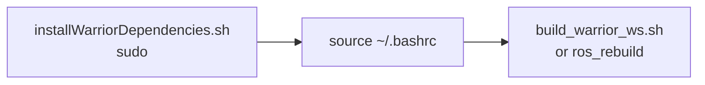

# warrior_scripts

Install + dev helper shell scripts. See the [workspace README](../README.md)
for overview.

## First-time install



```bash
sudo bash installWarriorDependencies.sh
source ~/.bashrc
bash build_warrior_ws.sh        # or the ros_rebuild alias
```

`installWarriorDependencies.sh` (Ubuntu 22.04 / WSL2):
- adds the ROS 2 apt repo + universe
- installs ROS 2 **Humble** desktop, `ros-dev-tools`, **Gazebo Fortress**
  (`ros-humble-ros-gz`), `ros2_control` + controllers, `gz_ros2_control`,
  `libeigen3-dev`
- appends to `~/.bashrc`: `source /opt/ros/humble/setup.bash` and the aliases below

| Alias | Expands to |
|---|---|
| `sorce` | `source ~/.bashrc` |
| `ros_rebuild` | `cd ~/ros2_ws && colcon build && source install/setup.bash` |

## Scripts

| Script | What it does | Usage |
|---|---|---|
| `installWarriorDependencies.sh` | One-shot dependency installer (ROS 2 Humble + Gazebo Fortress + ros2_control). Run with sudo. | `sudo bash installWarriorDependencies.sh` |
| `build_warrior_ws.sh` | Auto-detects the `warrior_ws*` root and runs `colcon build --packages-up-to warrior_bringup --symlink-install`. | `bash build_warrior_ws.sh [-w DIR]` |
| `pub_swerve_cmd.sh` | Publishes a `warrior_msgs/SwerveCmd` to `/warrior_swerve_command` at a fixed rate — manual swerve module bring-up/test. | `./pub_swerve_cmd.sh [id] [steer_rad] [drive_rad_s] [rate_hz]` |
| `deprecated_installWarriorDeps.sh` | **DEPRECATED** — old hardcoded installer (targets Gazebo Harmonic, `USERNAME=fire`). Do not use; superseded by `installWarriorDependencies.sh`. | — |

`build_warrior_ws.sh` workspace resolution order: `-w/--workspace` arg →
`$WARRIOR_WORKSPACE` env → auto-detect a `warrior_ws*` ancestor dir.

`pub_swerve_cmd.sh` defaults: `id=left steer=0.0 drive=0.0 rate=10`. Example:

```bash
./pub_swerve_cmd.sh front 0.785 32.0 10
```

## Launching the robot

This package only sets up the environment + offers test helpers. To launch
the robot, see [warrior_bringup](../warrior_bringup/README.md).
