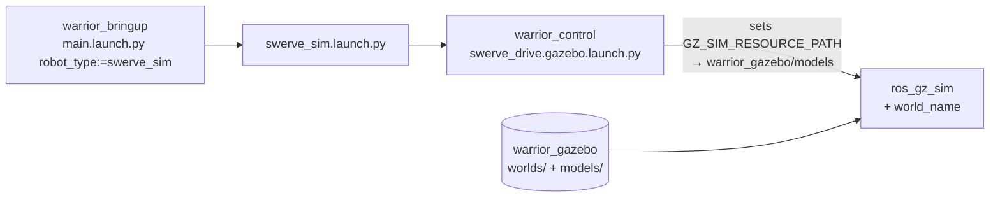

# warrior_simulation

Gazebo simulation assets for Warrior 2026. See the
[workspace README](../README.md) for the overall robot/teleop overview.

## Contents

| Sub-package | Build | Holds |
| --- | --- | --- |
| [warrior_gazebo](warrior_gazebo/) | `ament_cmake` | Sim worlds (`worlds/`) + SDF models (`models/`). No nodes/launch — see its [README](warrior_gazebo/README.md) for the full worlds + models tables. |

## Stack

**ROS 2 Humble** + **Gazebo Fortress (Ignition)** on **Ubuntu 22.04**.
(Not Gazebo Classic, not Garden/Harmonic/Ionic — `gz_ros2_control` ABI is
pinned to Fortress on Humble.)

## How worlds are launched

Worlds are not launched from this package. `warrior_bringup` sim launches
take a `world_name:=` arg and load the matching file from
`warrior_gazebo/worlds/`.



```bash
# full sim (default world per robot_type):
ros2 launch warrior_bringup main.launch.py robot_type:=swerve_sim
ros2 launch warrior_bringup main.launch.py robot_type:=diff_sim world_name:=competition.world

# direct:
ros2 launch warrior_bringup swerve_sim.launch.py world_name:=empty.world
ros2 launch warrior_bringup diff_sim.launch.py   world_name:=competition.world
```

Default worlds: `competition.world` (swerve_sim), `empty.world` (diff_sim),
`turtlebot3_world_gps.world` (turtlebot_sim). Full world list →
[warrior_gazebo/README.md](warrior_gazebo/README.md).

## Build

```bash
cd ~/ros2_ws
colcon build --packages-select warrior_gazebo
source install/setup.bash
```
